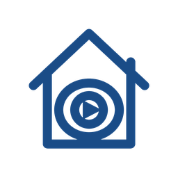

<p align="center">
  
</p>

<h1 align="center">Nexview for Home Assistant</h1>

<p align="center">
  What is waiting, what is running, whether the instances behind it still
  answer<br>and a way to approve or reject a request without opening Nexview at
  all.
</p>

<p align="center">
  <a href="https://github.com/hacs/integration"></a>
  
  
  
</p>

---

Brings [Nexview](https://nexview.nexapps.dev) into Home Assistant, and everybody
does it for themselves: enter your own access key and you get your own figures
and are notified about your own business. Somebody else in the same house
running their own Home Assistant gets theirs, and neither sees the other's.

## What you get

**The house at a glance.** Waiting requests, requests in progress, failures over
the last seven days, findings by severity, open tickets, and how full the
library is. All of them keep history, so a graph over a month costs nothing.

**Every Radarr and Sonarr as its own device**, hanging off Nexview: whether it
answers, what it is complaining about, how much is queued and how much of that
is stuck, whether it calls Nexview back at all, and a button to make Nexview
talk to it right now.

**Every media server as its own device.** Plex, Jellyfin and Emby each get one:
how many titles are on them, how many streams are running, and how many of
those the server is converting rather than sending as they lie. Who is watching
what comes from an action, not from a sensor - that belongs to the moment
somebody asks, not in a database that keeps everything for years.

**Allowances per account**, for the accounts you pick. Nexview applies a number
of titles and an amount of storage at the same time, either one being full
stopping a request, so both are shown and one sensor says plainly when
requesting is over for now. Nobody gets entities without being picked: an
installation with thirty accounts should not be handed two hundred entities by
an integration it just installed.

**A calendar** of what is coming out, sitting beside the bin collection rather
than in an app.

**Nexview itself in the update list**, so it does not sit at an old version for
months because nobody happened to look. It shows and does not install - that
part belongs to whatever runs your containers.

**Events** in three groups: requests, storage and operations. Each is an event
entity, so it shows up in the automation editor without a template, and one
subject does not wake automations that care about another.

**Actions that do**: approve, reject, defer, cancel.
**Actions that answer**: search, list requests, active downloads with progress,
allowances, and what is playing right now. Lists live here rather than in
entity attributes, which is where Home Assistant is moving them anyway.

**Only what your key may do.** Nexview hands out named access keys whose rights
follow the account they belong to, and a key can additionally be marked read
only. The integration asks what a key may do and creates only what fits - a
personal key produces a handful of entities, an operator's key the lot. Nothing
grey, nothing that answers 403 when pressed.

## Setting it up

1. In Nexview, open your profile and create an access key under **Access
   keys**. Give it a name you will recognise later, for instance
   `Home Assistant`. Copy it once - Nexview never shows it again.
2. In Home Assistant, add the **Nexview** integration, enter the address and
   paste the key.

That is all. The integration also tells Nexview where to call back, so events
arrive the moment they happen instead of up to half a minute later. It does that
by itself, including the confirmation code Nexview requires - nothing to copy
between two windows.

That callback belongs to your key and nobody else's. It carries exactly what you
would also see in your Nexview notification bell: your requests, your tickets,
your storage. Somebody else in the same house who adds this integration to their
own Home Assistant gets their own, and neither sees the other's. You can see the
address in Nexview under **Access keys**, next to the key that registered it, and
switch it off there or in the integration's options.

If Nexview cannot reach Home Assistant, everything still works, just slower,
and a repair notice says so rather than leaving you to wonder why events are
late.

## Approving from your phone

The reason this exists. Nexview tells Home Assistant that somebody asked for
something, your phone shows it with two buttons, and the answer goes straight
back:

```yaml
automation:
  - alias: Nexview request waiting
    triggers:
      - trigger: event.received
        target:
          entity_id: event.nexview_requests
        options:
          event_type: pending
    actions:
      - action: notify.mobile_app_your_phone
        data:
          title: "{{ trigger.to_state.attributes['title'] }}"
          message: "{{ trigger.to_state.attributes['body'] }}"
          data:
            actions:
              - action: NEXVIEW_APPROVE
                title: Approve
              - action: NEXVIEW_REJECT
                title: Reject
```

Two details that cost an evening to find, so they are written down here:

⚠️ **`target:` is not optional.** The entity goes underneath it, not beside it.
Written the other way the automation editor reports "no target set" and refuses
to save. In the editor this is the *Add target* button.

⚠️ **The event arrives as a state change, not as a bus event.** Its fields live
in `trigger.to_state.attributes`, and `trigger.event.data` does not exist. Use
square brackets rather than a dot: `attributes.title` resolves to Python's
string method `title` instead of the field, and what lands in the notification
is `<built-in method title of str object>`.

The two buttons are wired up with a second automation that listens for
`mobile_app_notification_action` and calls `nexview.approve_request` or
`nexview.reject_request`.

Every event carries `title`, `body`, `level`, `url` (where it points inside
Nexview), `image` and `nexview_event` with the original name Nexview used. The
same shape works for the other two entities - `event.nexview_operations` with
`event_type: ticket` for a new ticket, `event.nexview_storage` with
`release_requested` when somebody is asked to give storage back.

⚠️ **If `url` points somewhere unexpected**, check Nexview's public address in
its settings. Nexview builds that link itself, and a wrong address there sends
every notification - in Home Assistant and everywhere else - to the wrong
place.

## Requirements

Nexview 0.30.0 or newer. Older versions are turned away during setup with a
sentence explaining why - the integration needs an endpoint that tells it what
a key is allowed to do, and that arrived in 0.30.0.

## Installation

Until this is in the HACS default list, add it as a custom repository:

1. HACS, three dots, **Custom repositories**
2. Repository `DerKezorm/nexview-homeassistant`, category **Integration**
3. Install, restart Home Assistant, then add the integration

**HACS shows a grey box instead of the logo, and that is a HACS bug.** Since
Home Assistant 2026.3 an integration carries its own brand images and Home
Assistant serves them from `/api/brands/integration/…`. HACS still asks the old
CDN, which knows nothing about them, gets a 404 and falls back to a placeholder
([hacs/integration#5223](https://github.com/hacs/integration/issues/5223)). Once
installed, the logo shows up everywhere in Home Assistant itself: devices and
services, every device page, the search when adding it.

## When something does not work

**No entities beyond "Reachable".** The key decides what exists. Open the
integration's diagnostics (three dots on the entry, *Download diagnostics*) and
look at `key.may`: `verwalten` is what the house figures need, `entscheiden` is
what the approve buttons need. If `read_only` is true, the key was created with
that switch and can only ever show numbers.

**Events arrive late or not at all.** Home Assistant will have written a repair
notice saying so. Nexview has to be able to reach Home Assistant, not the other
way round, and the notice names the exact address it should call. A key without
`einrichten` cannot register that address by itself, so somebody has to add it
in Nexview under Settings, Notifications, Webhook.

**"This Nexview is too old".** The integration needs `GET /api/v1/me`, which
arrived in Nexview 0.30.0. Nothing else will make it work.

**A figure says "unavailable" rather than a number.** For an allowance, that is
the correct answer: the account has no limit, so there is nothing left over to
count. Elsewhere it means Nexview did not answer that particular call - the log
says which one, once, when it starts and when it stops.

## Removing it

Delete the entry in Home Assistant. That takes the entities and devices with
it, and unregisters the webhook.

**Then tidy up in Nexview**, because two things stay behind there:

1. Under Settings, Notifications, Webhook, delete the target named
   `Home Assistant (…)`. Otherwise Nexview keeps calling an address that no
   longer listens and fills its outbox with failures.
2. In your profile under Access keys, revoke the key you created for it.

## Known limitations

- **The callback needs Nexview 0.30.** Older versions only knew house-wide
  notification targets, which an ordinary account could not register at all -
  and which would have delivered every notification in the house rather than
  yours. The figures work against 0.30, events do not, and a repair notice says
  which of the two problems you have.
- **Nexview sends its notifications in one language per callback**, and the
  integration asks for the one this Home Assistant is set to. Change the
  language of Home Assistant and the callback keeps the old one until the entry
  is set up again.

- **Child profiles do not appear.** Nexview knows child accounts as
  sub-profiles of their parents, and their names and wishes deliberately stay
  out of a database that records everything forever.
- **One entry per account.** The same Nexview may be added twice with two
  different keys; the same account twice is refused.

## Development

Home Assistant does not run on Windows. On Linux, or in WSL:

```bash
python3 -m venv .venv
.venv/bin/pip install -r requirements-test.txt
.venv/bin/pytest
```

The `custom_components/nexview/api` package must never import from
`homeassistant` - a test enforces that. It is the part that will become
`python-nexview` on PyPI when this integration goes for inclusion in the Home
Assistant core, and that move should cost an import line, not a rewrite.
